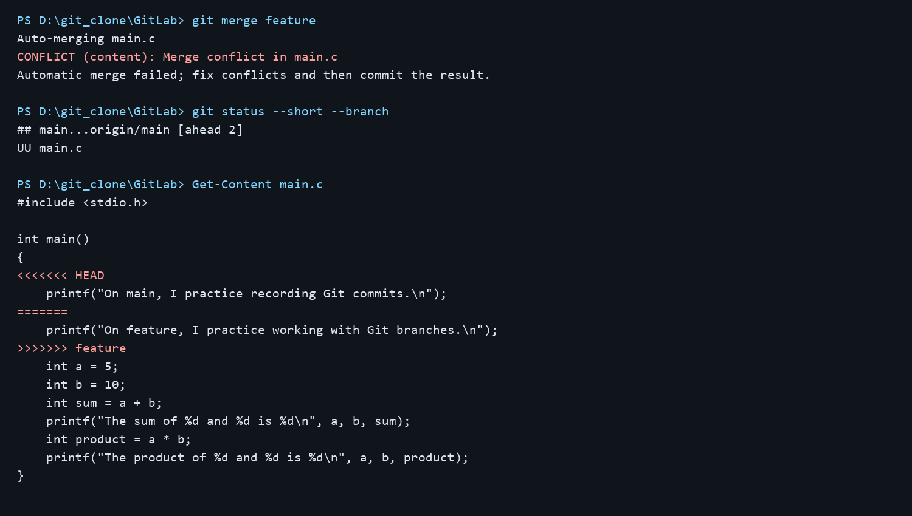
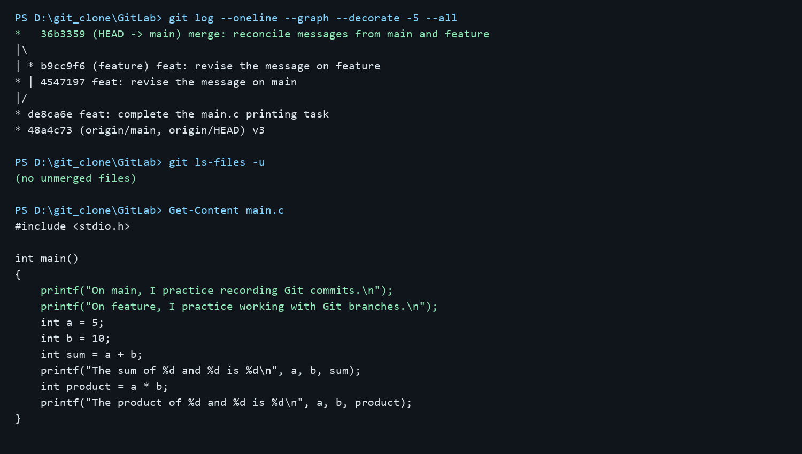

# Lab0：GitLab 实验报告

## 一、文档问题

### 1. 多人协同开发经历

我之前没有多人协同开发的经历。本次实验通过独立维护 `main` 和 `feature` 两条分支，初步练习了多人开发时常见的分工、提交与合并流程。

### 2. 为什么要分为“暂存”和“提交”

暂存区允许先从工作区挑选本次要保存的改动，再统一形成一个提交。例如同时修改了程序和报告时，可以先只暂存程序，使提交专注于一个目的；提交前还能用 `git diff --cached` 检查即将记录的内容，避免把未完成或无关的修改放入历史。`git commit` 则把选定的快照正式写入本地仓库，便于之后追溯与回退。

### 3. `git branch` 与 `git branch -a` 的区别

`git branch` 默认列出本地分支；`git branch -a` 同时列出本地分支和远程跟踪分支，例如 `remotes/origin/main`。远程跟踪分支是本地保存的远程状态引用，不等同于在远程服务器实时查询所有分支。当前所在分支会有 `*` 标记。

## 二、选读网页与学习体会

1. [《Commit message 和 Change log 编写指南》](https://www.ruanyifeng.com/blog/2016/01/commit_message_change_log.html)介绍了提交说明的用途，以及 `<type>(<scope>): <subject>` 的常见格式。清晰的提交说明能帮助浏览和检索历史，也便于整理变更日志。本实验中的代码和报告提交分别使用了 `feat`、`docs` 等类型。
2. [《语义化版本 2.0.0》](https://semver.org/lang/zh-CN/)规定版本号采用 `主版本号.次版本号.修订号`：不兼容的公共 API 变动增加主版本号，兼容的新功能增加次版本号，兼容的问题修复增加修订号；还定义了先行版本和构建信息。版本号因此能向使用者传达升级的兼容性预期。

我认为学习 Git 的意义在于：它能准确记录每次修改及其原因，让试验性工作在分支中进行，并支持把不同人的工作汇合到一起。发生冲突时，Git 会指出需要人工判断的位置；提交历史又能让之后的维护者理解修改过程。规范的提交说明与版本号进一步降低了协作和发布时的沟通成本。

## 三、实验步骤与结果

本实验在已克隆的个人仓库中进行，`origin` 为 `https://github.com/cenLily/GitLab.git`。

1. 将 `main.c` 的 `TODO` 改为输出自选语句，执行 `git add main.c`，以提交 `de8ca6e` 保存。
2. 从 `main` 创建并切换到 `feature`，将同一条输出语句改为分支练习提示，提交 `b9cc9f6`。
3. 切回 `main`，把同一行改为提交练习提示，提交 `4547197`。
4. 在 `main` 执行 `git merge feature`。由于两条分支从共同祖先出发修改了同一行，Git 报告 `CONFLICT (content): Merge conflict in main.c`，并在文件中写入 `<<<<<<< HEAD`、`=======`、`>>>>>>> feature` 标记。
5. 手动删除冲突标记，保留两条输出语句；执行 `git add main.c` 后提交合并结果 `36b3359`。`git ls-files -u` 没有输出，表明不存在未解决的合并文件。
6. 使用本机 Visual C 的 `cl /W4` 编译 `main.c` 并运行。程序依次输出两条分支练习提示、`15` 的求和结果和 `50` 的乘积结果。本机终端未提供 `gcc` 和 `make`，所以使用了等价的本地 C 编译验证。

### 合并冲突证据

下图根据本机实际执行的 Git 命令输出和当时的 `main.c` 内容排版保存。可见 `CONFLICT`、`UU main.c` 与文件中的冲突标记。

下图记录了解决后的合并提交、无未合并文件的检查结果，以及同时保留两条语句的 `main.c`。

